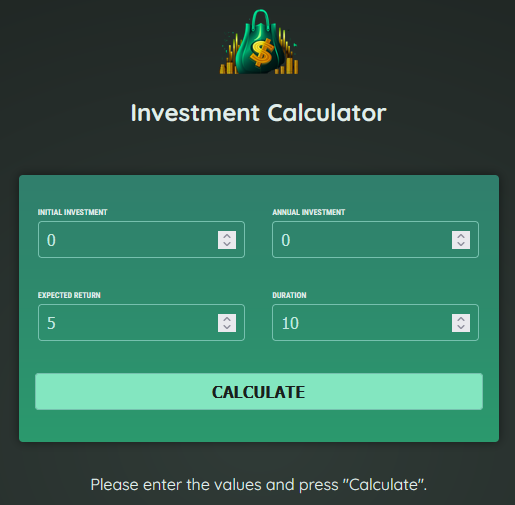
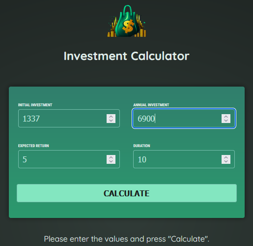
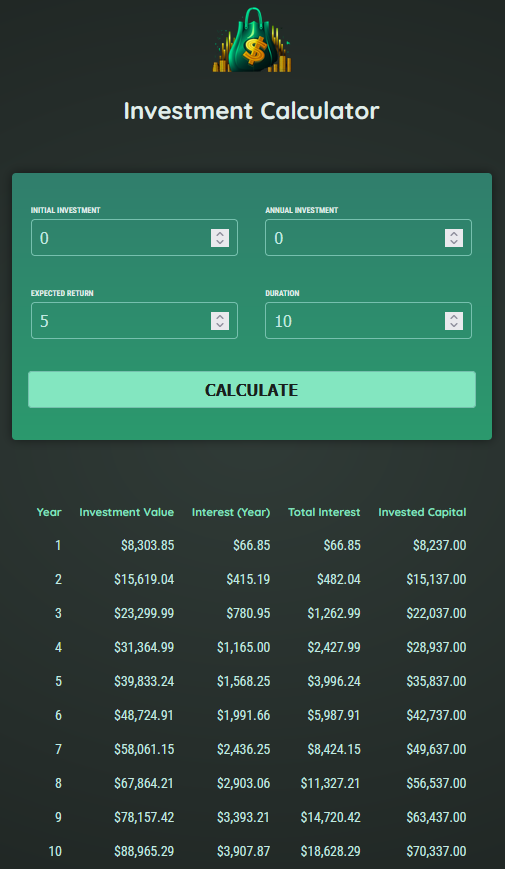

# 📈 Easy Investment Calculator

**Easy Investment Calculator** é uma aplicação Angular desenvolvida para simular investimentos com base em valores, taxas de juros e tempo. Ideal para fins didáticos, ela demonstra conceitos de formulários, bindings, cálculos e renderização dinâmica com Angular.

---

## 🚀 Tecnologias Utilizadas

- [Angular 20](https://angular.io/)
- TypeScript
- HTML5 & CSS3
- Vite (via Angular CLI)
- Node.js & npm

---

## ✨ Funcionalidades

- Entrada de valores iniciais, taxa de juros e período (em meses)
- Cálculo de montante final com base em juros compostos
- Exibição de resumo com valores formatados
- Layout simples, responsivo e direto ao ponto

---

## 📸 Screenshots

### 🏁 Tela Inicial


### 🧮 Preenchimento dos Dados


### 📊 Resultado da Simulação


---

## 🧬 Branches Disponíveis

| Branch | Descrição |
|--------|-----------|
| `main` | Versão básica funcional da calculadora |
| `feature/modules` | Refatoração aplicando Angular Modules |
| `feature/signals` | Reescrita utilizando Angular Signals para reatividade |

---

## 🛠️ Como Rodar o Projeto

### Pré-requisitos

- Node.js **v18.17.0 ou superior** (recomendado: **v20.x**)
- npm **v9 ou superior**

### Passos

```bash
# 1. Instale as dependências
npm install

# 2. Rode o projeto
npm start

📍 A aplicação estará disponível em http://localhost:4200
